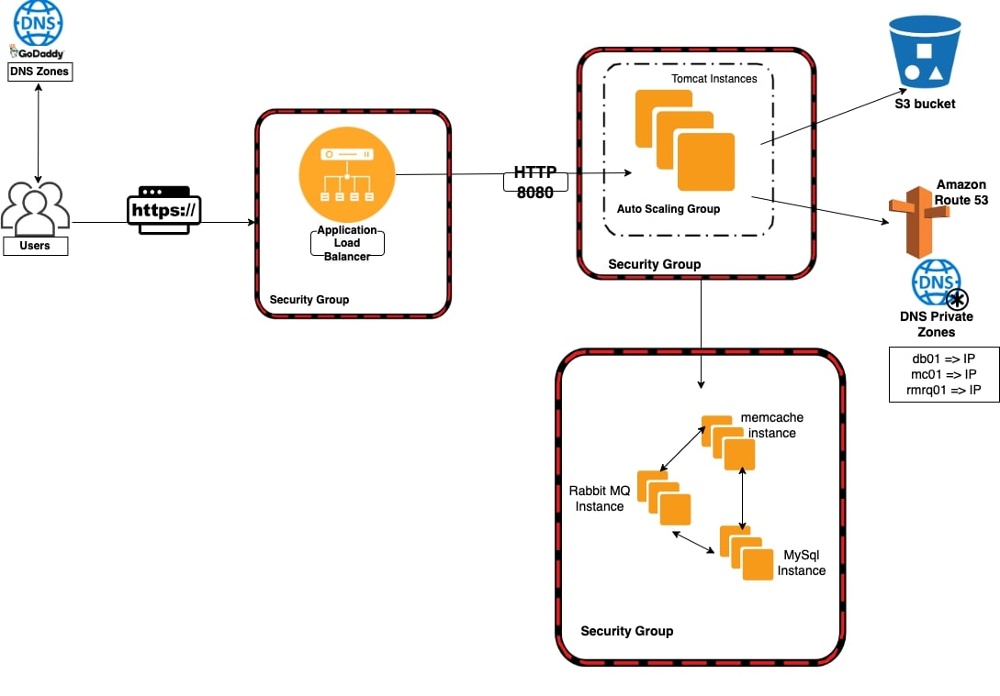
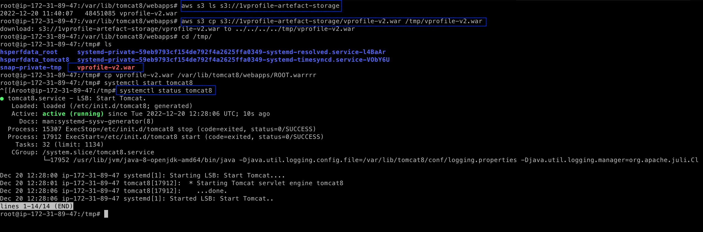
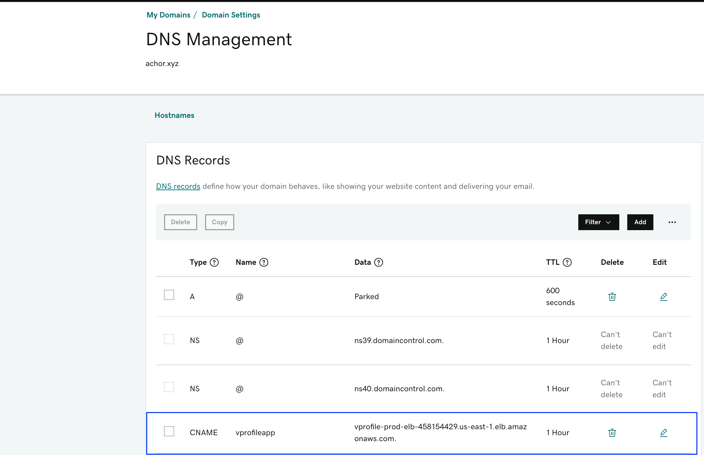
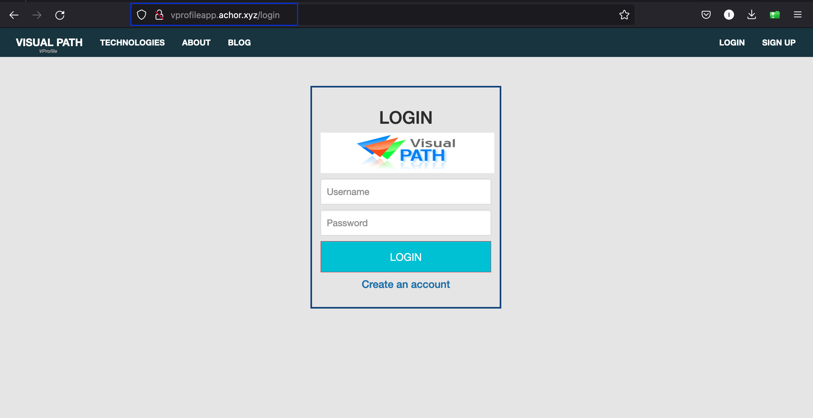
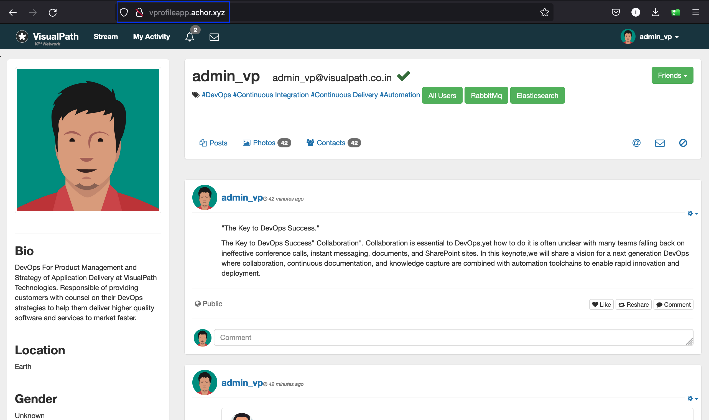
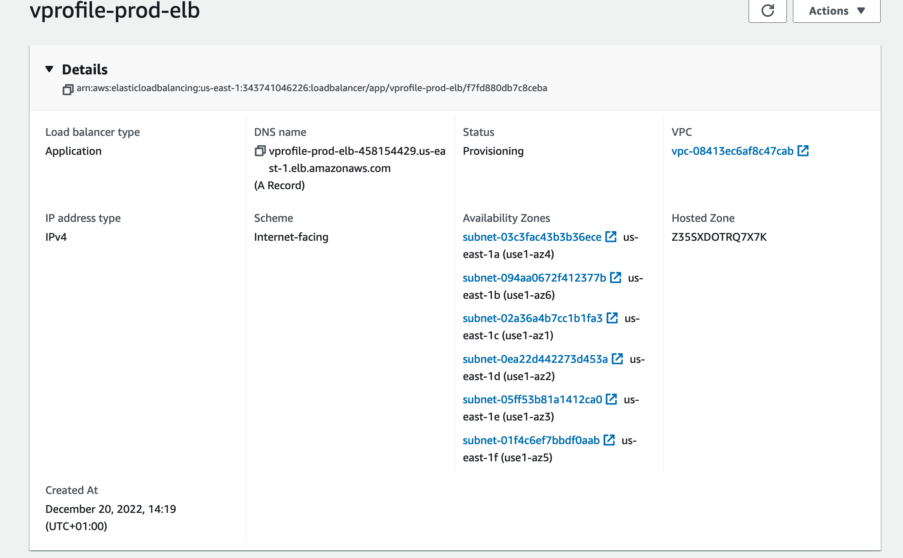

# AWS LIFT AND SHIFT

## About The Project

- Multi Tier Web Application stack
- Host & Run on AWS Cloud For Production
- Lift & Shift Strategy

## Resources

                AWS SERVICES
    |---------------------------------------|--------------------------------------------|
    |   EC2 INSTANCES                       | VM FOR TOMCAT, RABBIT MQ, MEMCACHE, MYSQL  |
    |---------------------------------------|--------------------------------------------|
    |   ELB [LOAD BALANCER]                 | NGINX LB REPLACEMENT                       |
    |---------------------------------------|--------------------------------------------|
    |   AUTOSCALING                         | AUTOMATION FOR VM SCALING                  |
    |---------------------------------------|--------------------------------------------|
    |   S3/EFS STORAGE                      | SHARED STOAGE                              |
    |---------------------------------------|--------------------------------------------|
    |   ROUTE 53                            | PRIVATE DNS SERVICE                        |
    |---------------------------------------|--------------------------------------------|

## Objectives

- Flexible Infrastructure
- No Upfront Cost
- IAAC

## Flow of Execution

- Login to AWS Account
- Create Key Pairs
- Create Security groups
- Launch Instances with user data [Bash Scripts]
- Update IP to name mapping in route 53
- Build Application from source code
- Upload to S3 bucket
- Download artifact to Tomcat Ec2 Instance
- Setup ELB with HTTPS [Cert from Amazon Certificate Manager]
- Map ELB Endpoint to website name in Godaddy DNS
- Verfiy app can be accessed with browser
- Build Autoscaling group for Tomcat Instances

## Stack Architecture

## Create Key pairs

## Create Security Groups

Security group for backend

Security group for ELB

Security group for app

## Launch Instances with script

Ec2 Instances

## Update IP to name mapping in route 53

Hosted Zone

Records in hosted zone

## Build Application from source code

Build app with maven

## Upload to S3 bucket

Create S3 bucket

## Download artifact to Tomcat Ec2 Instance

## Map ELB Endpoint to website name in Godaddy DNS

## Verfiy app can be accessed with browser

App Login Page

App Dashboard

## Build Autoscaling group for Tomcat Instances

Autoscaling Group

### Thank You!!!
